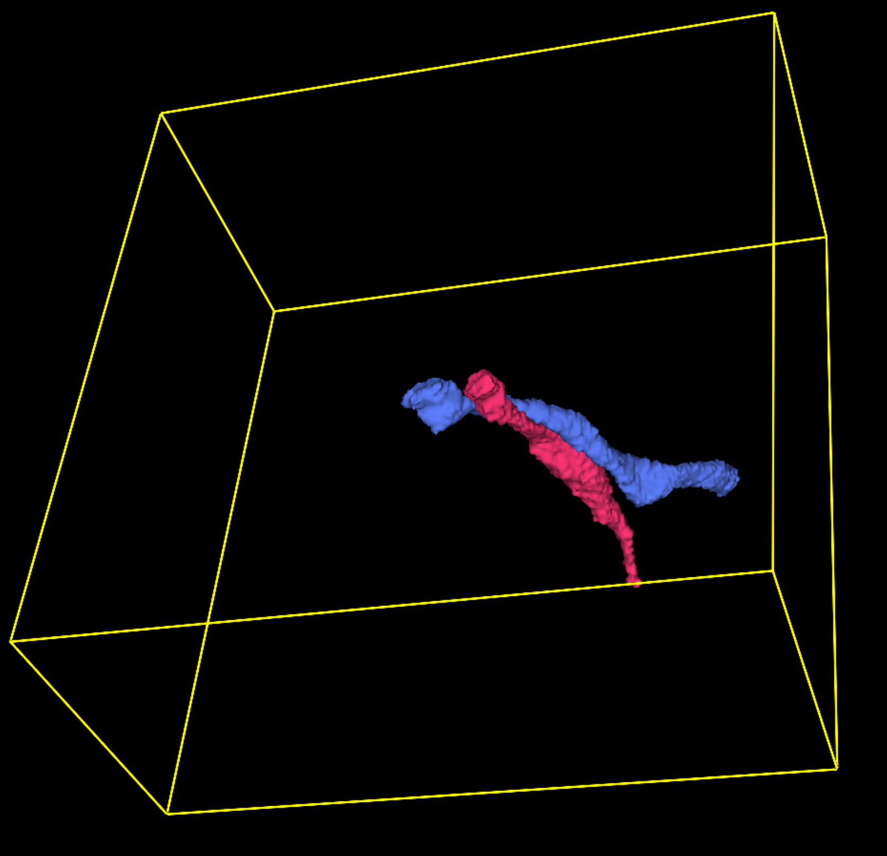
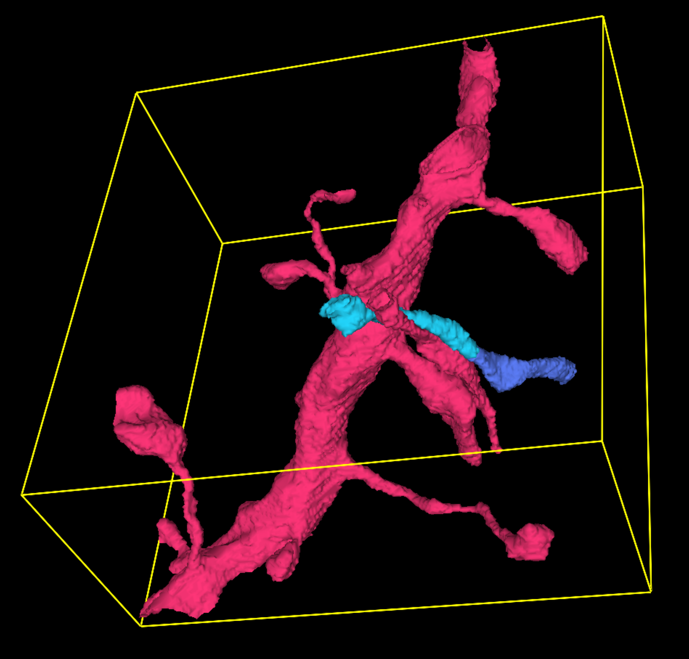

# erl
Evaluation script for expected run length (ERL)


- Installation
```
# create a new environment
pip install --editable .
```

# Example
- `python tests/test_volume.py -p tests/data/vol_pred.h5 -g tests/data/gt_graph.npz -r 30,30,30`
- `python tests/test_volume.py -p tests/data/vol_pred.h5 -g tests/data/gt_graph.npz -r 30,30,30 -m tests/data/vol_no-mask.h5`

<table>
  <tr align=center>
    <td>Ground Truth<br/> (2 seg)</td><td>Prediction<br/> (1 false merge and 1 false split)</td><td>No-merge Mask</td>
  </tr>
  <tr>
    <td> </td>
    <td></td>
    <td></td>
  </tr>
</table>


# Acknowledgement
---
- [Funkelab](https://github.com/funkelab): The main functionality is adapted from [this file](https://github.com/funkelab/funlib.evaluate/blob/master/funlib/evaluate/run_length.py)
- [jasonkena](https://jasonkena.github.io/): Reduce the memory usage by replacing the networkx object with a self-defined networkx-lite object.
